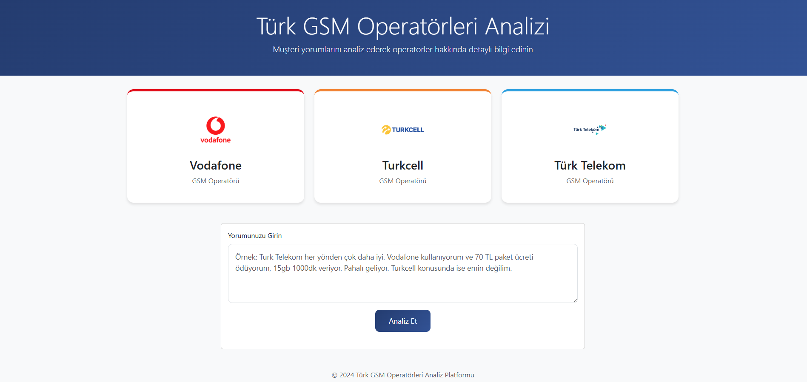
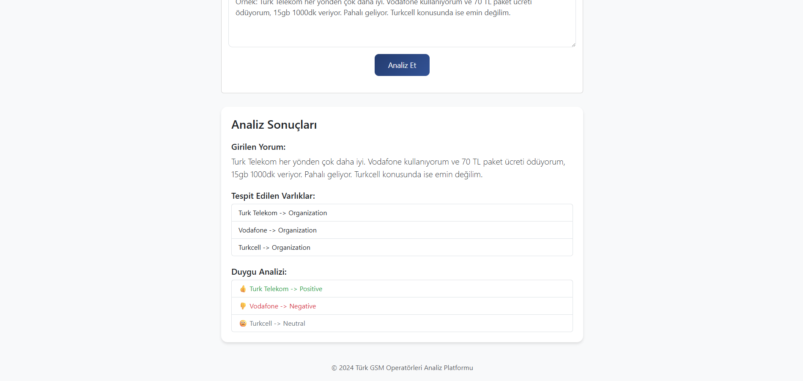

# Multi-Target Sentiment Analysis of Turkish Comments on GSM Operators

This project implements an end-to-end **Aspect-Based Sentiment Analysis (ABSA)** system designed specifically for Turkish-language user reviews in the GSM (mobile telecommunications) sector. The system integrates sentiment classification, named entity recognition (NER), and syntactic dependency parsing to associate multiple sentiments with the correct targets in complex sentences.

---

## 🧠 Project Overview

The ABSA pipeline includes:
- A **fine-tuned BERT model** for sentiment classification.
- A **custom NER model** for detecting telecom-specific entities: organizations, services, packets, and applications.
- Rule-based **dependency parsing algorithms** tailored to Turkish syntax.
- An **interactive FastAPI web interface** for real-time analysis.

---

## 📌 Key Features

- 🔍 Multi-target sentiment extraction in complex Turkish sentences  
- 💬 Named entity detection for domain-specific terms  
- ⚙️ Dependency parsing with participle & conjunction detection  
- 🌐 FastAPI-based user interface  
- 📊 Real data from GSM user reviews, tweets, and ChatGPT-generated samples

---

## 🗃️ Dataset

The dataset consists of **5,310 labeled entries**, sourced from:
- [Şikayetvar.com](https://www.sikayetvar.com) (user complaints)
- Kaggle datasets (Turkish telecom-related tweets)
- Synthetic examples from ChatGPT (sarcasm, multi-target, comparisons)

Each entry includes:
- Sentiment label (`0 = negative`, `1 = positive`, `2 = neutral`)  
- Manually labeled entities using Doccano  
- Suitable format for training both sentiment and NER models

---

## 🧩 System Architecture

```
User Sentence
     ↓
Named Entity Recognition (spaCy)
     ↓
Dependency Parsing (Custom Rules)
     ↓
Sentiment Classification (BERT)
     ↓
Output: Entity-Sentiment Pairs
```

---

## 🔧 Setup Instructions

1. **Clone the repository**
```bash
git clone https://github.com/iremalgul/turkish-gsm-absa.git
cd turkish-gsm-absa
```

2. **Create and activate the conda environment**
```bash
conda env create -f environment.yml
conda activate gsm-absa
```

3. **Run the FastAPI web app**
```bash
python mainapi.py
```

4. Open your browser and navigate to:  
👉 `http://127.0.0.1:8000`

---

## 🌐 Web Interface Features

- Input a Turkish user review
- Automatically detects GSM-related entities
- Parses the sentence and identifies sub-clauses
- Performs sentiment classification per entity
- Displays results as structured entity-sentiment pairs

### Example: Web Interface Screenshot


### Example: Analysis Result Output


---

## 📊 Performance Summary

| Component             | Metric      | Result |
|-----------------------|-------------|--------|
| Sentiment Classifier  | Accuracy    | 84%    |
| NER Model             | Accuracy    | 77%    |
| Dependency Parsing    | Manual Eval | ✅ Effective for complex syntax |

---

## 🚀 Future Directions

- Integrate transformer-based dependency parsing  
- Extend to other domains (e.g., banking, e-commerce)  
- Improve NER recall with larger annotated corpora  
- Deploy the FastAPI backend as a public RESTful service

---

## 📚 Acknowledgements

- **Supported by:** TÜBİTAK 2209-A Research Programme  
---


